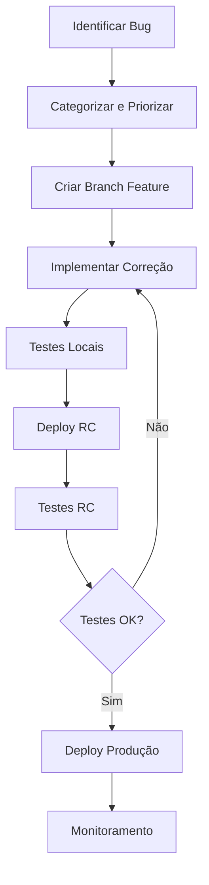

# Workflow de Qualidade e Correção de Bugs - Gikamura

## 📋 Visão Geral

Este documento estabelece um processo sistemático para identificação, correção e prevenção de bugs na Progressive Web App (PWA) Gikamura, garantindo alta qualidade e experiência do usuário.

## 🎯 Objetivos

- **Identificar proativamente** problemas e oportunidades de melhoria
- **Priorizar correções** baseadas no impacto no usuário
- **Implementar melhorias** de UX/UI e performance
- **Estabelecer testes** automatizados e manuais
- **Manter qualidade** constante através de processo estruturado

## 🔄 Processo de Workflow

### 1. Identificação de Problemas

#### 1.1 Fontes de Identificação
- **Testes automatizados** (`test-workflow.js`)
- **Debug logs** (ativar com `window.toggleGikamuraDebug()`)
- **Analytics locais** (monitoramento de erros)
- **Feedback de usuários**
- **Revisões de código**
- **Testes de acessibilidade**

#### 1.2 Categorização de Problemas
```
🔴 CRÍTICO - Bloqueia funcionalidade principal
🟠 ALTO - Impacta experiência significativamente
🟡 MÉDIO - Melhoria importante mas não urgente
🟢 BAIXO - Otimização ou melhoria menor
```

### 2. Priorização

#### 2.1 Critérios de Priorização
1. **Impacto no usuário** (1-5)
2. **Frequência de ocorrência** (1-5)
3. **Complexidade da correção** (1-5)
4. **Recursos necessários** (1-5)

#### 2.2 Fórmula de Prioridade
```
Prioridade = (Impacto × Frequência) - (Complexidade + Recursos)
```

### 3. Implementação

#### 3.1 Fluxo de Desenvolvimento


#### 3.2 Comandos de Deploy
```bash
# Testes locais
node test-workflow.js

# Deploy para RC com testes
./deploy-and-test.sh rc

# Deploy para produção (após validação RC)
./deploy-and-test.sh production
```

### 4. Categorias de Melhorias Implementadas

#### 4.1 Sistema de Busca e Autocomplete ✅
**Problema:** Conflito entre sistemas de busca
**Solução:** Refatoração integrada com coordenação de eventos
**Impacto:** Experiência de busca fluida e sem conflitos

#### 4.2 Tratamento de Erros ✅
**Problema:** Erros não tratados adequadamente
**Solução:** Sistema robusto com timeouts, retries e notificações user-friendly
**Impacto:** Maior estabilidade e feedback claro ao usuário

#### 4.3 Performance Mobile e Acessibilidade ✅
**Problema:** UX subótima em dispositivos móveis
**Solução:** CSS otimizado, atributos ARIA, navegação por teclado
**Impacto:** Aplicação inclusiva e responsiva

#### 4.4 Sistema de Debug ✅
**Problema:** Dificuldade para diagnosticar problemas
**Solução:** Debug toggleável, logs estruturados, monitoramento
**Impacto:** Desenvolvimento e manutenção mais eficientes

#### 4.5 Loading States e Feedback Visual ✅
**Problema:** Falta de feedback durante operações
**Solução:** Sistema de loading states, progress bars, notificações
**Impacto:** UX mais profissional e informativa

## 🧪 Testes e Validação

### Testes Automatizados
- **Validação de arquivos** (sintaxe, estrutura)
- **Verificação de acessibilidade** (ARIA, roles, skip links)
- **Testes de integração** (sistemas funcionando juntos)
- **Validação de PWA** (manifest, service worker)

### Testes Manuais - Checklist

#### Funcionalidade Core
- [ ] Carregamento inicial da aplicação
- [ ] Sistema de busca com autocomplete
- [ ] Navegação entre tabs
- [ ] Filtros e ordenação
- [ ] Sistema de favoritos
- [ ] Notificações e atualizações

#### Performance e Responsividade
- [ ] Carregamento rápido (<3s)
- [ ] Responsividade mobile (320px-2560px)
- [ ] Lazy loading de imagens funcionando
- [ ] Smooth scrolling e transições

#### Acessibilidade
- [ ] Navegação por teclado (Tab, Enter, Esc)
- [ ] Screen reader compatibility
- [ ] Contraste adequado
- [ ] Skip links funcionando
- [ ] ARIA labels corretos

#### PWA Features
- [ ] Instalação como app
- [ ] Funcionamento offline
- [ ] Service Worker ativo
- [ ] Notificações push (se habilitadas)

## 🔧 Ferramentas de Debug

### Debug Mode
```javascript
// Ativar debug
window.toggleGikamuraDebug()

// Verificar estados
console.log(store.getState())

// Monitorar loading
loadingManager.showFeedback('Debug ativo', 'info')
```

### Monitoramento de Performance
```javascript
// Lighthouse
// Core Web Vitals
// Analytics locais
analytics.getMetrics()
```

## 📊 Métricas de Qualidade

### KPIs de Sucesso
- **Taxa de sucesso de testes:** >95%
- **Performance Lighthouse:** >90
- **Acessibilidade Score:** >95
- **Time to Interactive:** <3s
- **Taxa de erro:** <1%

### Monitoramento Contínuo
- **Logs de erro** (console, analytics)
- **Performance metrics** (loading, rendering)
- **User engagement** (analytics locais)
- **Accessibility compliance** (auditorias regulares)

## 🚀 Processo de Release

### Pre-Release Checklist
- [ ] Todos os testes automatizados passando
- [ ] Testes manuais completos no RC
- [ ] Performance validada
- [ ] Acessibilidade verificada
- [ ] Debug desabilitado para produção
- [ ] Documentação atualizada

### Post-Release Monitoring
- [ ] Monitorar logs por 24h
- [ ] Verificar métricas de performance
- [ ] Coletar feedback inicial
- [ ] Documentar issues encontrados

## 📝 Documentação de Bugs

### Template de Bug Report
```markdown
## Bug: [Título Descritivo]

**Prioridade:** [CRÍTICO|ALTO|MÉDIO|BAIXO]
**Categoria:** [UI|Performance|Funcionalidade|Acessibilidade]

**Descrição:**
[Descrição clara do problema]

**Passos para Reproduzir:**
1. [Passo 1]
2. [Passo 2]
3. [Resultado]

**Comportamento Esperado:**
[O que deveria acontecer]

**Ambiente:**
- Device: [Desktop/Mobile]
- Browser: [Chrome/Firefox/Safari]
- Viewport: [dimensões]

**Screenshots/Logs:**
[Evidências visuais ou logs relevantes]

**Impacto:**
[Como afeta o usuário]

**Solução Proposta:**
[Se houver sugestão de correção]
```

## 🔄 Melhoria Contínua

### Retrospectivas Regulares
- **Frequência:** A cada release significativo
- **Participantes:** Desenvolvedores, testadores
- **Foco:** Processo, ferramentas, qualidade

### Evolução do Processo
- Automação crescente de testes
- Melhoria de ferramentas de debug
- Refinamento de critérios de qualidade
- Feedback loop com usuários

## 📚 Recursos e Referências

### Ferramentas
- [Lighthouse](https://developers.google.com/web/tools/lighthouse)
- [axe DevTools](https://www.deque.com/axe/devtools/)
- [WebPageTest](https://www.webpagetest.org/)

### Guias de Acessibilidade
- [WCAG 2.1 Guidelines](https://www.w3.org/WAI/WCAG21/quickref/)
- [MDN Accessibility](https://developer.mozilla.org/en-US/docs/Web/Accessibility)

### Performance
- [Core Web Vitals](https://web.dev/vitals/)
- [PWA Checklist](https://web.dev/pwa-checklist/)

---

**Última atualização:** Setembro 2025
**Responsável:** Equipe de Desenvolvimento Gikamura
**Versão:** 1.0

🤖 Generated with [Claude Code](https://claude.ai/code)